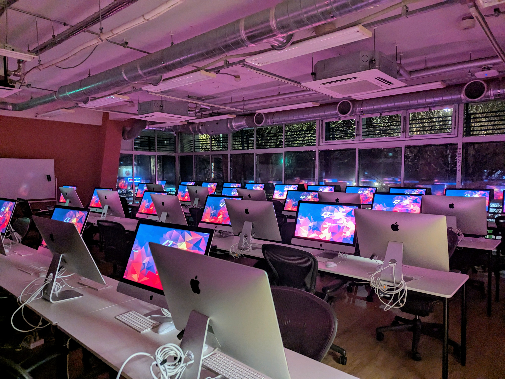
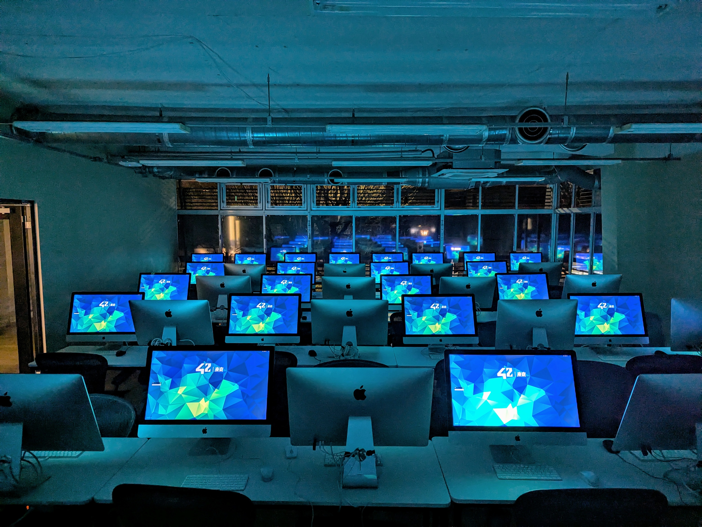

## Hi there 👋, my name is Yuki!

## 🙋‍♂️ About me
My coding journey started when I joined the [**42 Tokyo Piscine**](https://42tokyo.jp/) in Aug 2024! With absoloutly no coding experience beyond Scratch, it was definetly a hard month taking 2h long trains daily just to get to campus and grinding all day, but it was also very exciting!

   

<h3 align="center">
  #42Born2Code → #42BeyondTheCode 
</h3>

Just like the recent change of the 42 slogan, and after fighting the beloved [norminette](https://github.com/42School/norminette) for over a year, I’m looking forward to continuing learning from the 42 network and applying my new skills to projects!

## 🔭 I’m currently working on
- [42 CPP_Module_01](https://github.com/yuknakas/CPP_Module01)
- More to confirm in the next Semester!

## 🌱 I’m currently learning
I'm also a student at Whitman College! I haven't declared my major yet but my interests + classes are...
- CS: Took System Programing (understanding how systems work + assembly) → now heading to Software Development w/ Java!
- Chem: Currently taking the Orgo (Organic Chemistry) process → will continue to nex semster
- Digital Imaging and Vision Applications in Science (DIVAS) Alliance 2026 → Combining CS and Chem, my two big interests!
- Stats for Econ!

## 🧰 Languages and Tools

  
 

### 📊 Stats
  

<!--
**yuknakas/yuknakas** is a ✨ _special_ ✨ repository because its `README.md` (this file) appears on your GitHub profile.

Here are some ideas to get you started:

- 🔭 I’m currently working on ...
- 🌱 I’m currently learning ...
- 👯 I’m looking to collaborate on ...
- 🤔 I’m looking for help with ...
- 💬 Ask me about ...
- 📫 How to reach me: ...
- 😄 Pronouns: ...
- ⚡ Fun fact: ...
-->
